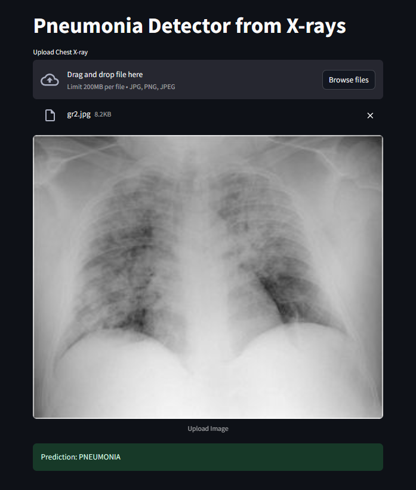
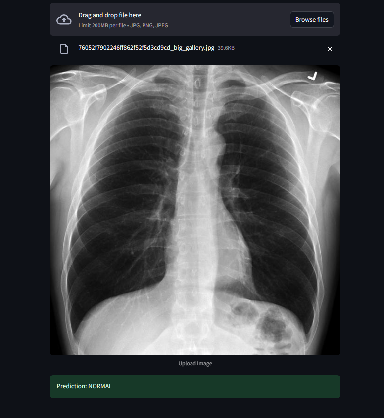

# Pneumonia Detection from Chest X-rays

This project uses a **Convolutional Neural Network (CNN)** to detect pneumonia from chest X-ray images. It's built using TensorFlow and deployed with Streamlit for a user-friendly web interface.

---

## Project Objective

To classify chest X-ray images as:

- Normal
- Pneumonia (infection)

This project demonstrates the use of **deep learning** in the healthcare domain to assist with **radiological diagnosis**.

---

## Dataset

We used the **Chest X-Ray Images (Pneumonia)** dataset from Kaggle:  
[Download from Kaggle](https://www.kaggle.com/datasets/paultimothymooney/chest-xray-pneumonia)

The dataset has three folders:
- `train/` – for training the model
- `val/` – for validation
- `test/` – for model evaluation

Each folder contains:
- `NORMAL/`
- `PNEUMONIA/`

---

## Tech Stack

- **Language:** Python
- **Framework:** TensorFlow + Keras
- **Deployment:** Streamlit
- **Model:** CNN (Convolutional Neural Network)
- **Image Processing:** Pillow (PIL)

---

## How to Run

### 1. Install Dependencies

```bash
pip install tensorflow streamlit numpy pandas matplotlib pillow
```

### 2. Train the Model

```bash
python train_model.py
```

This will save a trained model to `pneumonia_model.h5`.

### 3. Run the Streamlit App

```bash
streamlit run app.py
```

Then open your browser at [http://localhost:8501](http://localhost:8501)

---

## Output Example

> Below are some screenshots of the working application:






---

## Model Summary

- Uses 3 convolutional + max pooling layers
- Trained on rescaled images of size 150x150
- Final layer uses `sigmoid` for binary classification
- Validation accuracy improves with data augmentation

---

## Future Improvements

- Add Grad-CAM explainability to visualize decision regions
- Convert model to TensorFlow Lite for mobile deployment
- Add multiclass classification (e.g., COVID-19 detection)

---

## Disclaimer

This is an educational project and should **not** be used for actual medical diagnosis.

---

